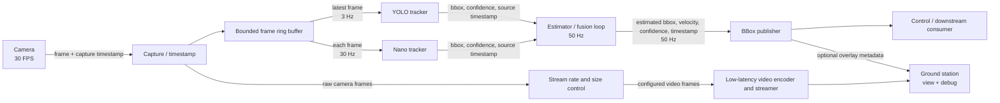
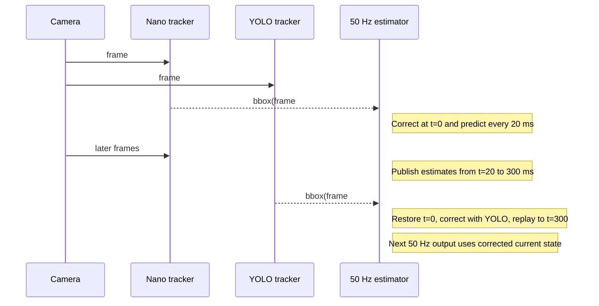
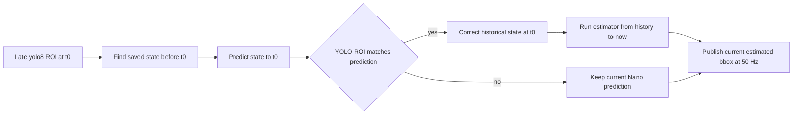
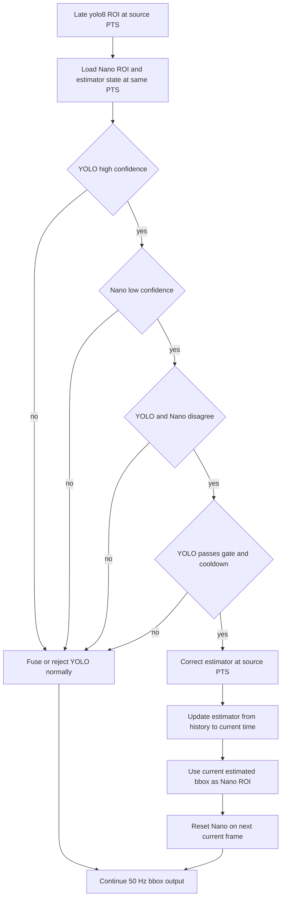

# Radxa Multi-Tracker Pipeline — Design Baseline

See [SIMULATION_DESIGN.md](SIMULATION_DESIGN.md) for the deterministic estimator development loop.

## 1. Goal

Run several object trackers on a Radxa device from one camera feed and publish a single, time-stamped bounding-box estimate at **50 Hz**.

Initial tracker set:

| Component | Input rate | Purpose |
| --- | ---: | --- |
| Camera | 30 FPS | Source images and capture timestamps |
| YOLO tracker | 3 Hz | Robust detector / tracker correction |
| Nano tracker | 30 Hz | Low-latency per-frame tracking |
| Estimator | 50 Hz | Fuse the latest measurements and predict between frames |
| BBox publisher | 50 Hz | Send the current estimate to the consumer |
| Ground-station stream | configurable | View and debug the same camera feed |

The 50 Hz output is an estimate, not a claim that the camera provides 50 new images per second. On ticks between camera frames, the estimator predicts forward using time and the most recent tracker measurements.

## 2. Overview



## 3. Data flow and timing

1. Capture assigns a monotonic capture timestamp and sequence number to every frame.
2. The frame ring keeps only a small, fixed number of recent frames. Workers read the newest available frame; they must never block camera capture.
3. Nano tracking runs once per camera frame. YOLO tracking runs every tenth frame (approximately 3 Hz), using the most recent frame when scheduled.
4. Each tracker attaches `GstVideoRegionOfInterestMeta`; the adapter extracts its bbox, confidence, `roi_type`, and source-buffer PTS.
5. The estimator owns the fused state. At 50 Hz it consumes all newer measurements, rejects stale/invalid ones, predicts state to `now`, and emits one estimate.
6. The video branch applies its own output frame-rate and image-size limits before encoding. A slow or disconnected ground station may drop video frames, but must not affect capture, tracking, or bbox output.

## 4. GStreamer bbox metadata contract

Use the existing `gst_rknn` `GstVideoRegionOfInterestMeta` as the tracker-result contract. Do not introduce a second bbox format in the GStreamer path.

| Source plugin | `roi_type` | Box fields | Extra fields |
| --- | --- | --- | --- |
| `rknnnanotrack` / `rknnnanotracker12` | `nanotrack` | `x`, `y`, `w`, `h` integer pixels; top-left origin | `initialized` boolean; `confidence` double is present only for non-initialization NanoTrack V3 results |
| `rknnyolov8` | `yolo8` | `x`, `y`, `w`, `h` integer pixels; top-left origin | `id` is the COCO class ID; `yolo8.confidence` is a double |

Each `GstBuffer` supplies the time identity through `GST_BUFFER_PTS(buffer)`. The estimator adapter must preserve that PTS when it extracts ROI metadata; it is the timestamp at which the image was captured/entered the pipeline, not the time that inference completed. `roi2udp` also sends this PTS first, followed by `roi_type,x,y,w,h,initialized,confidence,class_id,frame_id`; its `frame_id` is diagnostic-only and must not be used to match independent branches.

Convert a selected ROI into the estimator's internal measurement exactly once at the adapter boundary:

```text
TrackerMeasurement
  capture_pts_ns     # GST_BUFFER_PTS of the source frame
  tracker_name       # "nanotrack" or "yolo8"
  bbox_xywh_px       # x, y, width, height; same convention as GstVideoRegionOfInterestMeta
  confidence         # yolo8 parameter; Nano confidence when provided, otherwise configured default
  class_id           # yolo8 roi.id; absent for nanotrack
  initialized        # nanotrack parameter; absent for yolo8

EstimatedBBox
  output_time_ns     # estimator's monotonic 50 Hz tick time
  newest_capture_pts_ns
  bbox_xywh_px       # x, y, width, height
  velocity_xy_px_s   # centre velocity
  confidence
  status             # NO_TARGET, INITIALIZING, TRACKING, or PREDICTING
  valid              # true only for TRACKING or bounded-age PREDICTING
```

The adapter needs one clock conversion at startup: map the GStreamer running-time PTS domain to the estimator's monotonic clock. Thereafter compare and replay using the converted capture time. Do not use arrival time, UDP receive time, or `roi2udp`'s generated frame ID for fusion.

The estimator state uses bbox centre and velocity internally, but its output converts back to the native GStreamer top-left form: `x = centre_x - width / 2`, `y = centre_y - height / 2`. A constant-velocity predictor is sufficient for the first milestone; calibration/association policies can be added only after real data shows they are needed.

## 5. Scheduling and ownership

| Loop | Clock | Rule |
| --- | --- | --- |
| Capture | camera-driven, 30 Hz | Highest priority; never waits for consumers |
| Nano tracker | frame-driven, up to 30 Hz | Process newest unprocessed frame; drop backlog |
| YOLO tracker | 3 Hz | Process newest frame at scheduled tick; drop backlog |
| Estimator + publisher | monotonic timer, 50 Hz | Always publish, including prediction-only ticks |
| Video streaming | encoder/network-driven | Drop frames under pressure; isolated from tracking |

Queues between stages are bounded. On overload, discard old frames and retain the newest one. The estimator has a configurable delayed-measurement horizon derived from worst-case tracker inference latency plus margin; measurements older than that horizon are ignored.

### 5.1 Ground-station video rate and size control

The stream branch receives the original camera buffers from a `tee` and owns its output settings. Tracker branches always retain the camera's native 30 FPS and original resolution.

| Setting | Meaning | Rule |
| --- | --- | --- |
| `stream_width` / `stream_height` | Encoded frame dimensions | Set both to an aspect-ratio-preserving size supported by the encoder |
| `stream_fps` | Maximum encoded frame rate | Set independently of camera FPS; it may be lower than 30 FPS |
| `stream_bitrate_bps` | Encoder bit rate | Tune for link capacity; it does not affect estimator timing |

Use the standard GStreamer stages in this order on the stream branch:

```text
tee branch
  -> queue leaky=downstream
  -> videorate drop-only=true
  -> videoscale
  -> video/x-raw,width=STREAM_WIDTH,height=STREAM_HEIGHT,framerate=STREAM_FPS/1
  -> hardware H.264 encoder
  -> RTP or selected transport
```

`videorate drop-only=true` removes frames when `stream_fps` is lower than the camera rate; it never creates duplicate frames. The leaky queue drops stale video under network or encoder pressure, keeping the preview as current as possible. Size/rate conversion happens only after the `tee`, so changing stream settings cannot reduce Nano's 30 Hz input or alter the PTS used by the estimator.

### 5.2 Estimator startup and insufficient samples

The publisher still sends one `EstimatedBBox` message every 20 ms from process start. It must not fabricate a target before a tracker has provided enough evidence.

| Estimator status | Entry condition | 50 Hz output |
| --- | --- | --- |
| `NO_TARGET` | No accepted Nano or YOLO ROI | `valid=false`; bbox is unavailable |
| `INITIALIZING` | One accepted ROI | Seed centre and size from that ROI, set velocity to zero, and publish `valid=false` |
| `TRACKING` | A second compatible measurement at a later PTS | Estimate velocity from the time difference, update the filter, and publish `valid=true` |
| `PREDICTING` | No new accepted measurement on a 50 Hz tick | Predict from the last state and publish `valid=true` only while measurement age is within the configured limit |

For example, Nano's first box at `t=0 ms` starts `INITIALIZING`. The `t=0`, `20 ms` outputs retain its position and size with zero velocity but are explicitly invalid. Nano's next compatible box around `t=33 ms` supplies the first motion sample; velocity becomes `(centre_2 - centre_1) / (t_2 - t_1)`, and the following 50 Hz output becomes `TRACKING`. From then on, the estimator predicts at `20 ms` intervals between 30 Hz tracker frames.

A high-confidence YOLO result may be the first seed in exactly the same way. It does not need to wait for a second YOLO result: the next compatible Nano measurement is sufficient to establish velocity. If the second measurement fails the association gate, keep `INITIALIZING` only until the initialization timeout, then return to `NO_TARGET`.

Re-tracking resets Nano's template only; it does not erase an already valid estimator state. Keep publishing its bounded-age prediction while waiting for Nano's new first and second measurements.

## 6. Delayed tracker results and estimator fusion

YOLO commonly finishes after the camera has already produced newer frames. Its bbox is still useful, but it describes the image at `measurement.capture_pts_ns`, not the time at which YOLO finishes. Fuse it at that past capture time, then bring the corrected state forward to the present.

**Ownership:** delayed-history correction is implemented only by the estimator. The YOLO branch only runs inference and attaches `yolo8` ROI metadata with the source-buffer PTS; it never stores estimator history, replays state, or delays the video pipeline.



### 6.1 State history

Keep a fixed circular history of estimator snapshots, one for every 50 Hz tick, for at least the maximum accepted measurement delay. A snapshot contains:

```text
EstimatorSnapshot
  tick_timestamp_ns
  state                 # centre x/y, velocity x/y, width, height
  covariance            # uncertainty, if using a Kalman filter
  measurements_applied  # tracker name + source PTS for replay/deduplication
```

Recommended first sizing: retain `max_yolo_latency + 100 ms`, rounded up to 50 Hz ticks. For example, a measured 300 ms worst-case YOLO latency needs 20 snapshots (400 ms). Set the real number from device measurements, not guesswork.

### 6.2 Fusion algorithm on each 50 Hz tick

1. Drain newly completed tracker measurements, deduplicating by `(tracker_name, capture_pts_ns)` after selecting one ROI per tracker/frame.
2. For an on-time measurement, predict to its capture timestamp, correct with the measurement, and continue to the current tick.
3. For a delayed measurement inside history, restore the snapshot immediately before its capture time, predict to the capture time, correct there, then run only the lightweight estimator forward through the saved ticks to `now`. Reuse recorded measurements; never rerun a tracker.
4. For a measurement older than history, discard it and count it as `late_measurement_dropped`.
5. Predict from the last corrected state to the current tick and publish the resulting bbox at 50 Hz.

If several measurements share a frame timestamp, apply them in a deterministic order (Nano first, then YOLO) or combine them as one update. Determinism matters for debugging; the exact order can be tuned from recorded data.

### 6.3 How a late YOLO bbox corrects the current estimate

Example: YOLO receives a camera buffer with `PTS=10.000 s`, but its `yolo8` ROI metadata becomes available at `10.300 s`. At that moment the estimator has already published 15 outputs from `10.000 s` through `10.280 s`. Those outputs cannot be changed; the correction affects the next output at `10.300 s` and later.



1. Extract the chosen `yolo8` ROI: `x`, `y`, `w`, `h`, `roi.id`, and `yolo8.confidence`. Confirm its class is the selected class and that it is a plausible match to the estimator's historical prediction at `10.000 s`.
2. Convert the box to filter coordinates: `z = [x + w/2, y + h/2, w, h]`.
3. Find the saved estimator snapshot immediately before `10.000 s`. Predict that snapshot exactly to `10.000 s` using `dt`, then compare predicted centre/size with `z`.
4. If the difference passes the innovation gate, perform the YOLO measurement update at `10.000 s`. This corrects position, velocity, width, and height at the historical time. If it fails, drop the detection rather than snapping to a wrong object.
5. Update the estimator from `10.000 s` to the present. At each saved 20 ms tick, run the inexpensive state prediction and re-apply the Nano measurement(s) already recorded for that tick. Do not run Nano again or decode frames again. This preserves newer Nano motion while starting from the improved YOLO correction.
6. Predict the replayed state to the current 50 Hz tick and publish it as `EstimatedBBox`. Convert its centre back to GStreamer box form before publishing or overlaying.

The current estimate therefore moves by the amount that a corrected state at `10.000 s`, carried through 300 ms of velocity and newer Nano measurements, implies. It does **not** copy the old YOLO box directly onto the current video frame.

```text
At t=10.000 s:
  historical prediction: centre=(100, 80), velocity=(50, 0) px/s
  late YOLO measurement: centre=(110, 80)

At t=10.300 s:
  naive wrong approach: publish YOLO centre=(110, 80)        # 300 ms old
  fusion approach:      correct at 10.000, replay/predict -> centre near (125, 80)
```

`125` is illustrative: the actual result also reflects the filter gain and the recorded Nano measurements applied after `10.000 s`.

### 6.4 What each tracker contributes

Treat Nano as the frequent, low-latency motion measurement and YOLO as a slower, generally more reliable correction. Do not hard-replace the Nano bbox with a YOLO bbox. The estimator should weight them by uncertainty:

```text
Nano: lower latency, higher measurement uncertainty
YOLO: higher latency, lower measurement uncertainty
```

For the first implementation, use a constant-velocity Kalman filter with measurement vector `[center_x, center_y, width, height]`. Give YOLO lower measurement noise than Nano only after validating it against recorded video. The filter naturally makes a small correction for a low-confidence measurement and a larger correction for a trusted one.

### 6.5 Measurement acceptance

Reject a tracker result when any of these is true:

- Its capture timestamp is absent, in the future, or outside the history horizon.
- Its `(tracker_name, capture_pts_ns)` was already applied.
- The bbox is outside image bounds, non-positive, or confidence is below the tracker threshold.
- Its innovation is implausibly far from the predicted state; gate it using the filter's uncertainty (Mahalanobis gate once covariance is implemented).

On a rejected YOLO result, keep publishing the Nano-informed prediction. The 50 Hz output must not pause while waiting for either tracker.

### 6.6 Guarded Nano re-track from YOLO

YOLO can recover Nano when Nano has likely drifted to the wrong target. This is a **reinitialization request**, not a direct replacement of the current Nano bbox.

Evaluate the rule at the YOLO buffer's capture PTS, where both results refer to the same image:



```text
request_retrack =
  yolo_confidence >= yolo_retrack_threshold
  AND nano_confidence < nano_retrack_threshold
  AND IoU(yolo_bbox, nano_bbox_at_same_pts) < retrack_iou_threshold
  AND yolo_bbox passes the estimator's historical innovation gate
  AND retrack cooldown has expired
```

`nano_bbox_at_same_pts` must come from the saved Nano measurement on the YOLO source buffer PTS. Do not compare the delayed YOLO box with Nano's current box: target motion alone would create a false disagreement. If the Nano plugin did not emit a confidence value for that frame, skip this automatic re-track decision rather than guessing its score.

When the rule passes:

1. Fuse the accepted YOLO result at its historical PTS and update the estimator to the current 50 Hz tick.
2. Take the estimator's **current** `EstimatedBBox` and clamp it to the current camera dimensions.
3. Send that current box as the live `roi` property to `rknnnanotrack` or `rknnnanotracker12`. Both existing plugins reset tracking after an ROI assignment; the new template is captured on the next available current frame.
4. Mark the re-track request with the YOLO PTS and prevent another request until a configurable cooldown expires. Continue publishing estimator output while Nano initializes.

The current box in step 2 is essential. A YOLO bbox at `t=10.000 s` cannot be used unchanged on a Nano frame at `t=10.300 s`; object motion would initialize Nano at the wrong location.

Start with configuration values measured from video, not fixed constants:

| Setting | Purpose |
| --- | --- |
| `yolo_retrack_threshold` | Minimum YOLO confidence to authorize recovery |
| `nano_retrack_threshold` | Maximum Nano confidence considered unreliable |
| `retrack_iou_threshold` | Maximum overlap before boxes count as disagreeing |
| `retrack_cooldown_ms` | Prevent repeated reset loops while the tracker recovers |

Log every decision with both PTS, both boxes, confidences, IoU, and rejection reason. This provides the recordings needed to tune thresholds without destabilizing live tracking.

### 6.7 First milestone for delayed fusion

Start with timestamped synthetic measurements: emit Nano with 0 ms delay and YOLO with a known 200–300 ms delay for the same simulated target. Verify that a late YOLO correction changes subsequent 50 Hz estimates without rewinding published timestamps or producing a position jump larger than the configured gate.

## 7. Initial decisions

- One capture owner opens the camera; no tracker accesses the camera directly.
- Trackers run independently and communicate only through messages/queues.
- The estimator is the only writer of the published target state.
- All timing uses a monotonic clock; preserve camera capture time separately from processing and publish time.
- Encode the ground-station feed once from the capture branch. Add bounding-box overlay as an optional debug output, rather than making it part of the tracking path.

## 8. Open questions for the next design pass

1. Which Radxa board, OS, accelerator, camera interface, resolution, and target object count define the compute budget?
2. What transport does the bbox consumer require (UDP, ROS 2, MAVLink, shared memory, or another protocol)?
3. Does the estimator receive IMU/platform motion, and what end-to-end latency is acceptable?
4. What ground-station protocol is required (for example RTSP, WebRTC, or RTP/UDP), and is overlay video mandatory?
5. Is a single selected target sufficient, or must the pipeline maintain identities for multiple simultaneous objects?

## 9. First implementation milestone

Build only the skeleton needed to measure the real machine:

1. Capture 30 FPS frames with timestamps into a bounded latest-frame buffer.
2. Run placeholder Nano (30 Hz) and YOLO (3 Hz) workers that emit synthetic bbox measurements.
3. Run a 50 Hz constant-velocity estimator and log/publish `EstimatedBBox`.
4. Stream the raw camera feed to the ground station without coupling it to the workers.
5. Record capture-to-publish latency, dropped frames, worker runtimes, estimator measurement age, and stream drops.

Replace placeholders with actual models only after these measurements confirm the device can sustain the intended rates.
