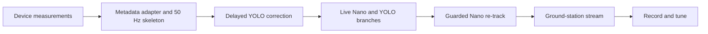

# Multi-Tracker Pipeline — Implementation Plan

This plan implements [DESIGN.md](DESIGN.md) in the smallest useful order. The first target is a 50 Hz estimator with recorded/synthetic measurements; camera, RKNN models, re-tracking, and ground-station video follow without changing estimator ownership.

## Scope and non-goals

- Reuse `gst_rknn` ROI metadata: `nanotrack` and `yolo8` `GstVideoRegionOfInterestMeta`.
- Keep delayed-result correction, tracker association, and re-track decisions in the estimator/controller process.
- Do not change `gst_rknn` tracker inference code for the first integration.
- Do not add a message broker, database, or a generic tracker-plugin framework.

## What to build from scratch

Do **not** build a new YOLO, NanoTracker, or ROI-to-UDP GStreamer plugin. Reuse the existing `gst_rknn` elements:

| Existing component | Use |
| --- | --- |
| `rknnnanotrack` or `rknnnanotracker12` | Per-frame Nano tracking and live `roi` reset |
| `rknnyolov8` | Low-rate YOLO detections with `yolo8` ROI metadata |
| `roi2udp` | Ground-station/debug metadata only |

Build these two small components instead:

| New component | Responsibility |
| --- | --- |
| `bbox_estimator_core` | Pure state machine: startup state, 50 Hz ticks, history correction, measurement gating, and re-track decision. It receives data and time as arguments; it has no GStreamer, thread, socket, or wall-clock dependency. |
| `tracker_pipeline` application | Owns the GStreamer pipeline, extracts ROI metadata/PTS, passes normalized measurements to the core, publishes its 50 Hz result, and assigns Nano's live `roi` property after an accepted re-track. |

This is deliberately not a new GStreamer estimator plugin. A normal transform runs when a video buffer arrives (30 Hz), while the required publisher runs from its own 50 Hz timer and must combine metadata from parallel branches. Putting the estimator in a small application makes that timing and the delayed-history buffer straightforward.

Build a GStreamer estimator/overlay plugin only later if a video-only consumer specifically needs fused ROI metadata attached to buffers. It cannot replace the independent 50 Hz publisher.

## Deterministic replay tests

Make the core deterministic before connecting a camera:

1. Represent every test input as one JSON Lines record: `arrival_tick_ns`, `capture_pts_ns`, tracker name, ROI fields, confidence, class, and a monotonically assigned input sequence.
2. Drive the core with explicit 20 ms tick records. The core never reads the system clock; `tracker_pipeline` supplies time in production and the replay runner supplies it in tests.
3. Process same-time records in one documented order: `capture_pts_ns`, then tracker priority (`nanotrack` before `yolo8`), then input sequence. Record the original arrival tick so delayed-YOLO behavior replays exactly.
4. Write every resulting `EstimatedBBox`, acceptance/rejection reason, and re-track request as JSON Lines.
5. Compare replay output to a checked-in expected JSON Lines file. Use exact integer timestamps/statuses and a documented float tolerance for bbox/covariance fields.

Start with four tiny fixtures:

| Fixture | Expected result |
| --- | --- |
| Startup | `NO_TARGET`, then `INITIALIZING`, then `TRACKING` after the second sample |
| Delayed YOLO | A 200–300 ms late YOLO result corrects the next output without changing prior output timestamps |
| Bad YOLO | Association gate rejects it; output follows Nano prediction |
| Drift and re-track | High YOLO + low Nano + low IoU yields one current-ROI reset, then cooldown suppresses repeats |

For a real run, save the same normalized input JSON Lines at the adapter boundary. Replaying that file with the same config must produce the same estimate sequence regardless of camera timing, NPU timing, or network jitter.

## Deliverables

| Deliverable | Done when |
| --- | --- |
| Metadata adapter | Converts `GstVideoRegionOfInterestMeta` plus buffer PTS into `TrackerMeasurement` without using arrival time |
| Estimator | Emits `EstimatedBBox` every 20 ms with startup states and delayed-measurement correction |
| Nano branch | Produces `nanotrack` metadata at camera rate |
| YOLO branch | Produces selected `yolo8` metadata at its configured low rate without blocking Nano |
| Re-track controller | Resets Nano only for an accepted high-YOLO/low-Nano disagreement |
| Video branch | Streams independently with configured size, frame rate, and bitrate |
| Measurements | Logs latency, dropped inputs, estimator age, re-tracks, and stream drops |

## Phase 0 — Establish the device budget

1. Record Radxa model, OS image, camera resolution/format, NPU runtime version, and encoder capability.
2. Measure actual Nano frame time, YOLO frame time, camera PTS cadence, and H.264 encode time on the target board.
3. Set initial limits from those measurements:
   - YOLO period
   - estimator history horizon: worst observed tracker latency plus 100 ms
   - stream width, height, FPS, and bitrate

**Acceptance:** a short report contains p50/p95/max time for capture, Nano, YOLO, and encoding. Do not select history size from a guessed latency.

## Phase 1 — Metadata adapter and estimator skeleton

1. Receive tracker buffers in-process after their `gst_rknn` elements, preserving `GST_BUFFER_PTS` and ROI metadata. Use `roi2udp` only for debug viewing, not as the primary fusion transport.
2. Extract `nanotrack` and `yolo8` fields exactly as defined in `DESIGN.md`.
3. Normalize PTS into the estimator monotonic-time domain once at pipeline start.
4. Implement a monotonic 20 ms timer that always emits `EstimatedBBox`.
5. Implement `NO_TARGET`, `INITIALIZING`, `TRACKING`, and bounded-age `PREDICTING` states.

**Acceptance:** a synthetic source with one bbox produces 50 Hz `INITIALIZING` messages; a second timestamped bbox establishes velocity and produces `TRACKING` messages. No output uses receive time as source time.

## Phase 2 — Delayed-measurement correction

1. Store a circular history of 50 Hz estimator snapshots and applied measurements.
2. On a late measurement, restore the preceding snapshot, correct at the measurement PTS, and run only the estimator forward to the current tick using recorded measurements.
3. Reject duplicate, malformed, out-of-horizon, or association-gate-failing measurements.
4. Count accepted and rejected late measurements by tracker source.

**Acceptance:** inject Nano at zero delay and YOLO at 200–300 ms delay for the same simulated target. The next output changes from the late YOLO correction; output timestamps stay monotonic and no tracker inference is re-run.

## Phase 3 — Build the live GStreamer branches

1. Open the camera once and split it with a `tee` plus bounded/leaky queues.
2. Send every source frame to `rknnnanotrack` or `rknnnanotracker12`.
3. Send the newest scheduled frame to `rknnyolov8` at the configured low rate. Preserve its source PTS through the branch.
4. Select one YOLO ROI per frame using the target class and the estimator's historical association gate before fusion.

**Acceptance:** Nano stays at its measured target rate while YOLO is enabled. A slow YOLO branch must increase neither camera drops nor Nano processing latency.

## Phase 4 — Guarded Nano re-track

1. At a YOLO source PTS, load the matching saved Nano ROI.
2. Request re-track only when high-confidence YOLO, low-confidence Nano, low IoU, historical association acceptance, and cooldown conditions all pass.
3. After delayed YOLO fusion, send the estimator's current box to Nano's live `roi` property. The next Nano frame initializes the new template.
4. Keep estimator output live during reinitialization; do not use the old YOLO box directly on a current Nano frame.

**Acceptance:** a recorded drift scenario resets Nano once and recovers the target. Normal motion and a noisy YOLO result do not reset Nano.

## Phase 5 — Ground-station video

1. Add an independent stream branch after the camera `tee`.
2. Apply `queue leaky=downstream`, `videorate drop-only=true`, `videoscale`, caps for output width/height/FPS, hardware H.264 encoding, and the chosen transport.
3. Send ROI/estimated-bbox data as optional overlay metadata. Video transport failure must not stop tracking.

**Acceptance:** changing stream FPS or size does not change tracker input PTS/cadence. Disconnecting the ground station leaves 50 Hz bbox output running.

## Phase 6 — System test and tuning

Record a representative camera run and report:

- 50 Hz output count and jitter
- capture-PTS-to-publish latency and measurement age
- Nano/YOLO execution time and dropped frames
- accepted/rejected delayed measurements
- re-track count and cooldown suppressions
- video encoding/network drops

Tune tracker uncertainties, association gate, confidence thresholds, history horizon, and stream settings only from these recordings.

## Implementation order

## First end-to-end milestone

The first usable demo is: camera input, live Nano metadata, synthetic delayed YOLO metadata, a 50 Hz estimated bbox log, and a raw low-rate video stream. Replace synthetic YOLO with `rknnyolov8` only after this proves PTS correlation and delayed correction on the Radxa.
