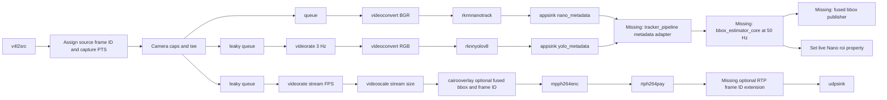

# Real GStreamer Pipeline and Missing Components

`tracker_pipeline` is the process that creates this pipeline, receives metadata from the two `appsink`s, runs the independent 50 Hz estimator timer, and publishes fused bbox output.



## Pipeline branches

The application builds equivalent GStreamer syntax below. Values in `${...}` are deployment configuration, not shell defaults.

```text
v4l2src device=${CAMERA_DEVICE}
  ! video/x-raw,format=NV12,width=${CAMERA_WIDTH},height=${CAMERA_HEIGHT},framerate=30/1
  ! identity name=source_frames
  ! tee name=camera

camera.
  ! queue max-size-buffers=2 leaky=downstream
  ! videoconvert ! video/x-raw,format=BGR
  ! rknnnanotrack enabled=true roi=${INITIAL_ROI} models-dir=${NANO_MODELS_DIR}
  ! appsink name=nano_metadata emit-signals=true sync=false

camera.
  ! queue max-size-buffers=1 leaky=downstream
  ! videorate drop-only=true ! video/x-raw,framerate=${YOLO_FPS}/1
  ! videoconvert ! video/x-raw,format=RGB
  ! rknnyolov8 model=${YOLO_MODEL}
  ! appsink name=yolo_metadata emit-signals=true sync=false

camera.
  ! queue max-size-buffers=2 leaky=downstream
  ! videorate drop-only=true
  ! videoscale ! videoconvert
  ! video/x-raw,format=BGRx,width=${STREAM_WIDTH},height=${STREAM_HEIGHT},framerate=${STREAM_FPS}/1
  ! cairooverlay name=debug_overlay
  ! videoconvert ! video/x-raw,format=I420
  ! mpph264enc bps=${STREAM_BITRATE_BPS} gop=${STREAM_FPS} header-mode=each-idr
  ! h264parse ! rtph264pay pt=96 config-interval=1
  ! udpsink host=${GROUND_STATION_HOST} port=${VIDEO_PORT} sync=false async=false
```

`identity name=source_frames` is a probe point, not an ID generator. `tracker_pipeline` assigns a monotonically increasing `source_frame_id` and records it with the buffer's `GST_BUFFER_PTS` there, before the `tee`. The application keeps the short `PTS <-> source_frame_id` map for all branches. Each 50 Hz estimator output has its own output tick time; it must not be used as the video frame ID.

The input PTS reaches each branch with its source buffer. `tracker_pipeline` extracts `GstVideoRegionOfInterestMeta` and `GST_BUFFER_PTS` in each appsink callback, looks up `source_frame_id`, then enqueues a normalized measurement for `bbox_estimator_core`. Appsink callback arrival time is logged but never used as the measurement timestamp.

## Video overlay and client synchronization

Two modes are supported; enable both for field debugging.

### Server-side debug overlay

Use the existing GStreamer `cairooverlay` element in the stream branch. Its draw callback, implemented by `tracker_pipeline`, looks up the current video buffer's `source_frame_id` and PTS, predicts/selects the fused estimate for that PTS, and draws:

- fused bbox and tracking status;
- `source_frame_id` and source PTS; and
- optional Nano and YOLO boxes in separate colours.

This is the simplest debug view: the box is already burned into the image, so the ground station does not have to synchronize a second data stream.

### Metadata-only client overlay

For a client-rendered overlay, send one side-channel record per encoded video frame:

```text
VideoOverlayRecord
  source_frame_id
  capture_pts_ns
  estimated_bbox_xywh_px
  status
  estimator_output_time_ns
```

The record is generated in the video branch from the estimator state selected/predicted to that video's PTS; it is not simply the latest 50 Hz output. The client matches on `source_frame_id` first and uses PTS only for diagnostics/fallback.

An encoded H.264/RTP video packet does not preserve arbitrary GStreamer metadata. Therefore, a client cannot receive `source_frame_id` merely because it existed on the raw camera buffer. Choose one of these transport options:

| Option | Status | Use |
| --- | --- | --- |
| Burn `source_frame_id` into the `cairooverlay` image | Available now | Human debug, no programmatic matching |
| Carry `source_frame_id` in an RTP header extension | **Missing** `rtpframeidpay` / client depay support | Robust client-side metadata matching |
| Use video PTS plus jitter-buffer mapping | Available but weaker | Debug only; do not use as the sole control/data association key |

The estimator's regular 50 Hz fused-bbox publisher remains separate from these per-video-frame overlay records.

## Missing implementation status

| Item | Status | What to implement |
| --- | --- | --- |
| `rknnnanotrack` / `rknnnanotracker12` | Existing in `gst_rknn` | Reuse; setting its live `roi` property requests template reset on the next frame |
| `rknnyolov8` | Existing in `gst_rknn` | Reuse; select the target `yolo8` ROI in the application |
| `roi2udp` | Existing in `gst_rknn` | Optional debug metadata path only |
| `tracker_pipeline` | **Missing** | Application that owns pipeline lifecycle, appsink callbacks, PTS normalization, Nano ROI writes, and bbox transport |
| `bbox_estimator_core` | **Missing** | Pure deterministic 50 Hz startup/prediction/history-correction/re-track engine |
| Fused bbox publisher | **Missing** | Small transport adapter selected after the consumer protocol is chosen; it receives only `EstimatedBBox` from the core |
| RTP frame-ID extension | **Missing, optional** | `rtpframeidpay` and matching client support; carries `source_frame_id` with encoded video for metadata-only overlay |

Do not implement `bbox_estimator_core` as a GStreamer transform: transforms are driven by arriving video buffers at 30 Hz, whereas this component must publish independently at 50 Hz and combine delayed metadata from two branches.

## Build order

1. Implement `bbox_estimator_core` with JSON Lines deterministic replay inputs.
2. Implement `tracker_pipeline` with synthetic appsink-like input first, then replace it with the live branches above.
3. Add the selected fused bbox publisher transport.
4. Add the live Nano `roi` reset after delayed YOLO correction is passing replay tests.
5. Enable the video branch last; it must remain optional to tracking.
